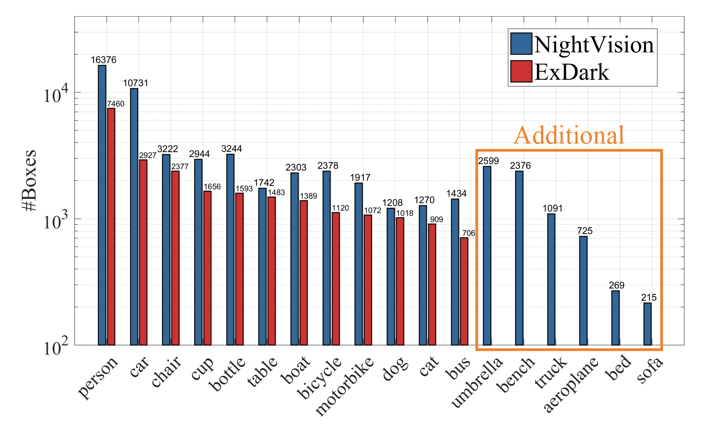
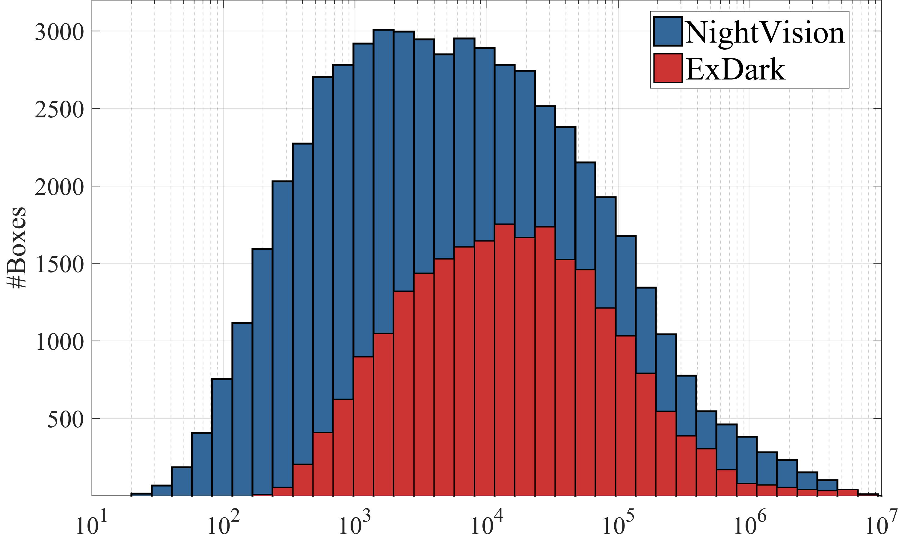

# Improving Zero-shot Low-light Object Detection via Handling of Motion Blur
## NightVision Dataset 
We collect a considerable dataset named NightVision for low-light object detection. 
Compared to the [ExDark](https://github.com/cs-chan/Exclusively-Dark-Image-Dataset) dataset, NightVision covers a wider range of dark data, including 10,023 images and 56,044 objects of 18 categories. The yolo format of NightVision is provided at [Google Drive](https://drive.google.com/drive/folders/1eY8GRkz7gkbm-4JwJt3pqvmhtfx_XFuV?usp=drive_link).

  

